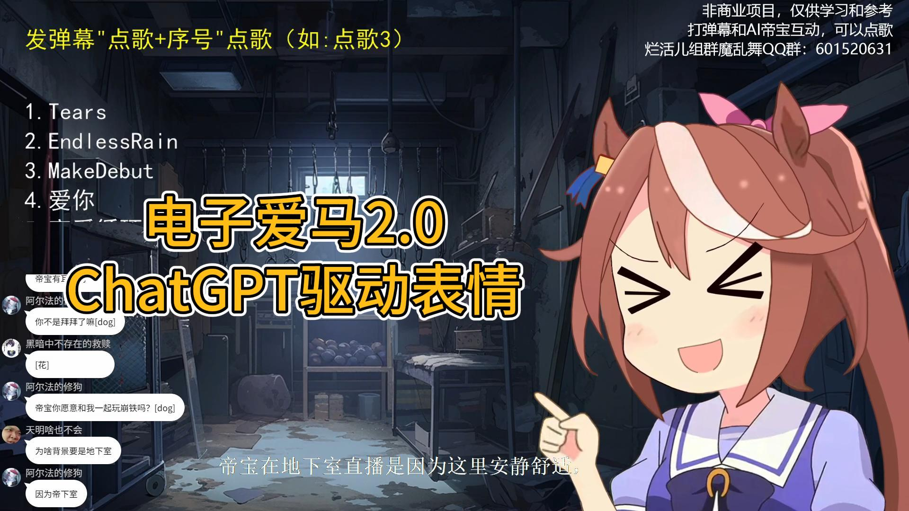

# AI虚拟直播主播

一个可在B站直播的AI虚拟直播主播程序展示。项目使用[ChatGPT](https://openai.com/blog/chatgpt)作为AI引擎驱动逻辑, 使用[VITS](https://github.com/jaywalnut310/vits)进行语音合成，使用Live2D做角色表现。

## 项目展示
<!--- https://github.com/mattcone/markdown-guide/blob/master/_basic-syntax/line-breaks.md: two or more spaces--->
- [1.0 Demo](https://www.bilibili.com/video/BV13L41197oZ)  

- 2.0 Demo
  - [点歌系统](https://www.bilibili.com/video/BV1Rp4y157of)  

  - [表情系统](https://www.bilibili.com/video/BV1ok4y1A7fb/)  


## 项目功能和特点

- 使用ChatGPT作为AI引擎，具体使用了[ChatGPT(revChatGPT)](https://github.com/acheong08/ChatGPT)第三方库
- 使用VITS进行语音合成，具体使用的是崩坏3和马娘数据集训练的中日语言权重。这里是该语音合成模型[Demo](https://huggingface.co/spaces/zomehwh/vits-uma-genshin-honkai)
- 使用Live2D做角色表现
- 使用[VTube Studio API](https://github.com/DenchiSoft/VTubeStudio)驱动角色表情动画，使用ChatGPT获得角色说话感情。具体使用第三方库[pyvts](https://github.com/Genteki/pyvts)
- 整个项目使用多进程并行优化，弹幕拉取、请求ChatGPT服务、声音合成、语音播放以及动画控制全部并行处理，保证角色与观众实时互时的响应速度
- 点歌功能，角色在唱歌途中会答谢观众的点赞和礼物。歌曲曲目使用AI变音技术([Sovits](https://github.com/svc-develop-team/so-vits-svc)，[DiffSVC](https://github.com/prophesier/diff-svc)等)制作。
- 简单的字幕界面

## 使用方法

```python
python app.py
```

## 贡献者

### 主要开发人员

烂活儿组：

- 喵喵抽风 [GitHub主页](https://github.com/whiteeat) [B站主页](https://space.bilibili.com/7627329)
- LeoJk南 [GitHub主页](https://github.com/leojnjn) [B站主页](https://space.bilibili.com/603987001)
- CYMIC [GitHub主页](https://github.com/hellocym) [B站主页](https://space.bilibili.com/88937421)

### AI合成歌曲作品贡献者名单

- CYMIC：Endless Rain, Tears
- LeoJk南：爱你，恋爱循环等
- Τυχαίο：春天的风，今天你要嫁给我等 [B站主页](https://space.bilibili.com/381910197)
- 某滋服服：向轮椅奔去（非AI） [B站主页](https://space.bilibili.com/294006665)

### 特别感谢

- CjangCjengh [GitHub主页](https://github.com/CjangCjengh) [B站主页](https://space.bilibili.com/35285881)  
感谢他设计的跨语言注音和训练方法。[项目地址](https://github.com/CjangCjengh/vits)
- Saya睡大觉中 [GitHub主页](https://github.com/SayaSS) [B站主页](https://space.bilibili.com/5955895)  
感谢他训练的高质量赛马娘中日权重。[B站展示视频](https://www.bilibili.com/video/BV1UG4y1W7Ji/) [在线Demo](https://huggingface.co/spaces/zomehwh/vits-uma-genshin-honkai)

### 其他感谢

- choom [GitHub主页](https://github.com/aierchoom) [B站主页](https://space.bilibili.com/95978418)  
技术支持
- 天使西纳奈 [B站主页](https://space.bilibili.com/3494352250734879)
项目初期最忠实的粉丝，积极参与测试
- 还有其他支持该项目的小伙伴们

### 加入我们

烂活儿组群魔乱舞QQ群：601520631
