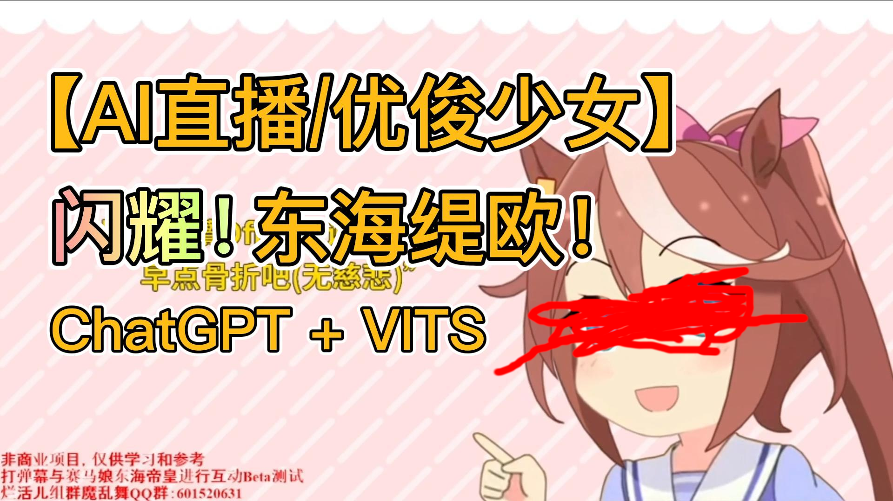

# AI虚拟直播主播

一个可在B站直播的AI虚拟直播主播程序展示。项目使用[ChatGPT](https://openai.com/blog/chatgpt)作为AI引擎驱动逻辑, 使用[VITS](https://github.com/jaywalnut310/vits)进行语音合成，使用Live2D做角色表现。

## 项目展示
<!--- https://github.com/mattcone/markdown-guide/blob/master/_basic-syntax/line-breaks.md: two or more spaces--->
- [1.0 Demo](https://www.bilibili.com/video/BV13L41197oZ)  

- 2.0 Demo（施工中）

## 项目功能和特点

- 使用ChatGPT作为AI引擎，具体使用了[ChatGPT(revChatGPT)](https://github.com/acheong08/ChatGPT)第三方库
- 使用VITS进行语音合成，具体使用的是崩坏3和马娘数据集训练的中日语言权重。这里是该语音合成模型[Demo](https://huggingface.co/spaces/zomehwh/vits-uma-genshin-honkai)
- 使用Live2D做角色表现
- 使用[VTube Studio API](https://github.com/DenchiSoft/VTubeStudio)驱动角色表情动画，使用ChatGPT获得角色说话感情。具体使用第三方库[pyvts](https://github.com/Genteki/pyvts)（施工中，程序已经完成但简单的美术表现还未制作完成）
- 整个项目使用多进程并行优化，弹幕拉取、请求ChatGPT服务、声音合成、语音播放以及动画控制全部并行处理，保证角色与观众实时互时的响应速度
- 点歌功能，角色在唱歌途中会答谢观众的点赞和礼物
- 简单的字幕界面

## 使用方法

```python
python app.py
```
